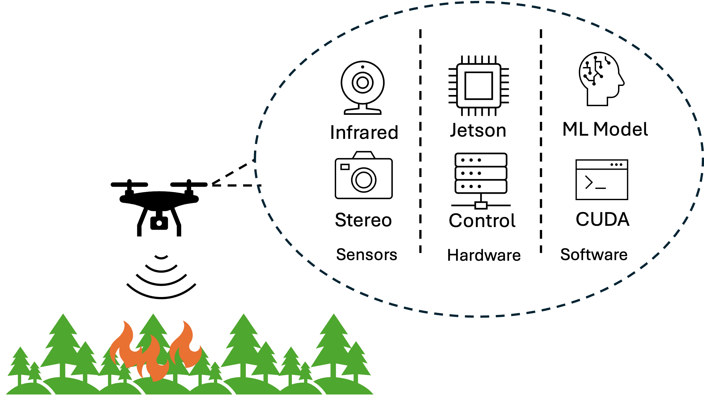

# VLM-Firewatch

This project proposes the development of a real-time wildfire detection system deployed on a drone equipped with a Jetson Orin Nano. We aim to begin classification of wildfires using a Visual Language Model (VLM). Our first step to achieving this goal is to begin searching for relevant datasets online. Through detailed research, we have decided to proceed with the FLAME dataset and datasets based on it (FLAME3, FlameVision) as well as the Places365 validation set (to prevent class imbalance). These datasets take advantage of sensor fusion and utilize it to combine the IR and feed data. Our first step is to aggregate these 3 datasets together into VQA format (question-answer, as shown below) such that our eventual model can classify images into fire being present and no fire being present.



## 0 - Creating a `conda` environment

> NOTE: Architecture Limitations
>
> Please note that the below conda setup assumes that you have a H100 system running some form of modern Linux and CUDA 12.6.1. The environment specifications are directly exported from our environment on this platform. Any attempt to use different hardware and software will require updating torch/transformers/pycuda. If you feel brave, you may install the `generic_environment.yaml` file to get non-versioned dependencies. There is no support or guarantee of success provided for such an installation.

We use `conda` to handle all needed Python dependencies. To work with a conda environment, you must first install [conda](https://docs.conda.io/projects/conda/en/stable/user-guide/install/index.html). Once installed, run the below to create the environment:

```console
conda env create -f env/environment.yml
```

Once the environment has been created, you must activate it by running:

```console
conda activate vlm_firewatch_env
```

## 1 - Setting up Source Datasets

Any code involving data for the project can be found in `src/data/`. This folder is responsible for loading, aggregating, and therefore processing all four of our source datasets into a unified dataset. We use the following four dataset linked below:
- FLAME
- FLAME3
- FlameVision
- Places365 (You do not need to download this manually.)

Once you have downloaded the datasets, you must extract them to a convenient location on your machine. Once extracted, navigate to `src/data/dataset_configs.py` and replace the below source paths with your paths. Note that the folders pointed to by the paths must match, so take great care to ensure that they do. You must also create a folder to store the unified dataset that we will create.

```python
flame_config = {
    "src": "<path-to>/FLAME/Training",
}

flame3_config = {
    "src": "<path-to>/flame3/FLAME 3 CV Dataset (Sycan Marsh)",
}

flamevision_config = {
    "src": "<path-to>/flamevision/Classification",
}

places_365_config = {
    "src": "<path-to>/places365",
    "processed": "<path-to>/places365/processed_nofire_samples"
}

unified_config = {
    "src": "<path-to>/unified_dataset"
}

moondream_config = {
    "fine_tuned": "/<path-to>/finetuned_moondream",
    "quantized": "<path-to>moondream2_tuned_int8.engine",
    "onnx": "<path-to>/moondream2_tuned.onnx"
}
```

> [NOTE] For the Places365 dataset, our code will automatically download it for you as long as the src path is set to a valid folder. We recommend that you create a folder named `places365` and set the source path to that. Remember to include that path for the processed path as well.

Next, we must create the unified dataset. To do this, you must run the `src/data/process_datasets.py` script. This script uses the dataset configuration to load, aggregrate, and process the unified dataset from the constituent datasets. To run the script, you must run:

```console
python src/data/process_datasets.py
```

## 2 - Running Baseline Inference on the Unified Dataset

All of our inference code can be found in `src/train/`. To run our baseline inference, please run the below scripts. The results from inferencing on the baseline models will be stored in  `src/train/results`. Please note that there is no base YOLO inference script: the YOLO classifier must be retrained for binary classification. Instead, we compare it to an always taken classifier as a baseline.

```python
python inference_base_efficientnet.py

python inference_moondream2.py
```

We only support running with default arguments. Note that the Moondream2 inference script takes the following arguments:

#### Input/Output Configuration

- **`--test_json`** (str, default: from `unified_config`)  
  Path to the test dataset JSON file containing image paths, questions, and ground truth answers for evaluation.

- **`--output_file`** (str, default: "results/inference_results_base.json")  
  Path where inference results and metrics will be saved as JSON. Includes predictions, ground truths, and comprehensive evaluation metrics.

#### Hardware Configuration

- **`--device`** (str, default: "cuda")  
  Device to run inference on. Options: `cuda` for GPU or `cpu` for CPU execution.

#### DataLoader Configuration

- **`--batch_size`** (int, default: 1)  
  Number of images to process in each batch during inference. Larger batches can speed up inference but require more memory.

- **`--num_workers`** (int, default: 2)  
  Number of parallel worker processes for data loading. Higher values can improve data loading speed but use more CPU and memory.

#### Visualization

- **`--plot_cm`** (flag, default: False)  
  Generate and save a confusion matrix visualization showing prediction performance. Saves as PNG file with the same name as `output_file` but with `_confusion_matrix.png` suffix.

## 3 - Training Baseline Classification Models and VLM

All of our training code can be found in `src/train/`. This directory includes configurations for fine-tuning, training (aka fine-tuning) scripts, and dataloaders to help load the unified dataset. The results from finetuning the baseline models will be stored in  `src/train/results` while the model weights themselves will be saved in `src/train/models`. We will discuss how the VLM is saved in that section later.

To train/fine-tune the classifier models, run the below:

```python
python train_efficientnet.py

python train_yolo.py
```

Before proceeding, ensure you have set correct paths for `moondream_config` in the `src/data/dataset_configs.py` file. This is neccesary to save the model correctly. In order to fine-tune the VLM, you must run the following script:

```python
python finetune_moondream2.py
```
We only support running with default arguments. Please note that the VLM fine-tuning script takes in optional arguments, namely:

- **`--batch_size`** (int, default: 4)  
  Number of samples processed together in each training iteration. Larger batches use more GPU memory but can improve training stability.

- **`--grad_accum_steps`** (int, default: 2)  
  Number of gradient accumulation steps before performing an optimizer update. Effective batch size = `batch_size × grad_accum_steps`. Use this to simulate larger batches when GPU memory is limited.

- **`--epochs`** (int, default: 2)  
  Total number of complete passes through the entire training dataset.

- **`--learning_rate`** (float, default: 1e-4)  
  Initial learning rate for the optimizer. Controls the step size during gradient descent. The script applies warmup and cosine decay scheduling.

#### Dataset Limits

- **`--max_train_samples`** (int, default: None)  
  Maximum number of training samples to load. When `None`, uses the entire training dataset. Useful for quick experiments or debugging.

- **`--max_val_samples`** (int, default: None)  
  Maximum number of validation samples to load. When `None`, uses the entire validation dataset.

#### LoRA Configuration

- **`--use_lora`** (flag, default: False)  
  Enable LoRA (Low-Rank Adaptation) for parameter-efficient fine-tuning. When enabled, only trains low-rank adapter weights instead of all model parameters, reducing memory usage and training time.

- **`--lora_r`** (int, default: 32)  
  LoRA rank dimension. Controls the capacity of the adapter layers. Higher values (16-64) allow more expressiveness but use more memory. Only applies when `--use_lora` is set.

- **`--lora_alpha`** (int, default: 64)  
  LoRA scaling parameter. Typically set to 2× the rank (`lora_r`). Controls the magnitude of adapter updates. Only applies when `--use_lora` is set.

#### Logging & Testing

- **`--use_wandb`** (flag, default: False)  
  Enable Weights & Biases logging for experiment tracking. Logs training loss, validation loss, learning rate, and other metrics to W&B dashboard.

- **`--test_mode`** (flag, default: False)  
  Run in test mode with reduced dataset size for quick validation. Automatically sets `max_train_samples=50`, `max_val_samples=10`, `epochs=1`, and `batch_size=2`.

## 4 - Running Inference on Fine-Tuned VLM

Now that you have a fine tuned VLM, we can evaluate it. This code is also found in `src/train/`. Run the below script:

```python
python inference_finetuned_moondream2.py
```
We only support running with default arguments. It takes the below arguments:

#### Model Configuration

- **`--model_path`** (str, default: from `moondream_config["fine_tuned"]`)  
  Path to the directory containing the fine-tuned model weights. Should contain `pytorch_model.bin`, `model.safetensors`, or similar weight files along with model configuration.

#### Input/Output Configuration

- **`--test_json`** (str, default: from `unified_config`)  
  Path to the test dataset JSON file containing image paths, questions, and ground truth answers for evaluation.

- **`--output_file`** (str, default: "results/inference_results_finetuned.json")  
  Path where inference results and metrics will be saved as JSON. Includes predictions, ground truths, and comprehensive evaluation metrics.

#### Hardware Configuration

- **`--device`** (str, default: "cuda")  
  Device to run inference on. Options: `cuda` for GPU or `cpu` for CPU execution.

#### DataLoader Configuration

- **`--batch_size`** (int, default: 1)  
  Number of images to process in each batch during inference. Larger batches can speed up inference but require more memory.

- **`--num_workers`** (int, default: 2)  
  Number of parallel worker processes for data loading. Higher values can improve data loading speed but use more CPU and memory.

#### Visualization

- **`--plot_cm`** (flag, default: False)  
  Generate and save a confusion matrix visualization showing prediction performance. Saves as PNG file with the same name as `output_file` but with `_confusion_matrix.png` suffix.

## 5 - Quantize the Fine-Tuned VLM

To quantize the fine-tuned VLM, we take advantage of ONNX and TensorRT. 
All of our quantization code can be found in `src/quantize/`. We must first convert the original model to ONNX format. Run the below.

```python
python export_onnx.py
```

Next, we can build a TensorRT engine (INT8 as opposed to model float16). Please note that this script will be slow upon first run due to building a calibration cache. Run the below:

```python
python convert_tensort.py
```

## 5 - Inference on the Quantized VLM

All of our inference code can be found in `src/train/`. Please run the below script:

```python
python inference_quantized_moondream2.py
```

We only support running with default arguments. Note that it takes the following arguments:

#### Model Configuration

- **`--model_path`** (str, default: from `moondream_config["fine_tuned"]`)  
  Path to the directory containing the fine-tuned text model weights. Should contain `pytorch_model.bin`, `model.safetensors`, or similar weight files. The vision encoder is replaced by TensorRT, so only text model weights are loaded.

- **`--trt_engine`** (str, default: from `moondream_config["quantized"]`)  
  Path to the TensorRT engine file (`.trt` or `.engine`) containing the quantized INT8 vision encoder. This replaces the PyTorch vision encoder for accelerated inference.

#### Input/Output Configuration

- **`--test_json`** (str, default: from `unified_config`)  
  Path to the test dataset JSON file containing image paths, questions, and ground truth answers for evaluation.

- **`--output_file`** (str, default: "src/train/results/inference_results_quantized.json")  
  Path where inference results and metrics will be saved as JSON. Includes predictions, ground truths, and comprehensive evaluation metrics.

#### Hardware Configuration

- **`--device`** (str, default: "cuda")  
  Device to run the text model on. Options: `cuda` for GPU or `cpu` for CPU execution. Note: TensorRT vision encoder always runs on GPU via CUDA.

#### DataLoader Configuration

- **`--batch_size`** (int, default: 1)  
  Number of images to process in each batch during inference. Larger batches can speed up inference but require more memory.

- **`--num_workers`** (int, default: 2)  
  Number of parallel worker processes for data loading. Higher values can improve data loading speed but use more CPU and memory.

#### Visualization

- **`--plot_cm`** (flag, default: False)  
  Generate and save a confusion matrix visualization showing prediction performance. Saves as PNG file with the same name as `output_file` but with `_confusion_matrix.png` suffix.


## 6 - Performance Evaluation

All of our performance testing code is found in `src/performance`. We provide performance evaluation scriptsfor regular NVIDIA hardware and for the Jetson platform where we must use the `tegrastats` utility. To generate performance data for regular hardware (e.g H100), run:

```python
python power_lat.py
```

To run on the Jetson (unsupported as of time of writing due to Jetpack regression with memory allocation for large PyTorch models):

```python
python measure_power_lat.py
```

## 7 - Visualization

All of our visualization code is found in `src/visualize`. You can run the below scripts to generate graphs in `src/visualize/graphs`. Note that you must update the data within each script (they are not dynamic).

```python
python create_accuracy_graphs.py

python create_power_graphs.py
```

## Other Notes

- We used SLURM heavily for model training/inference due to time needed for both.
- We also tried object detection to explore how that performed. The scripts and code can be found in `src/train`. We do not provide support for them explicitly as they serve as an exploration rather than result.
- Saved model weights for the tuned classifiers can be found in `src/train/models`.
- We provide proof of work in the `outs` folder. You may use this as reference to compare with your outputs when running the code.
